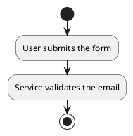

# ChatGPT File Store — MCP Server

A [Model Context Protocol](https://modelcontextprotocol.io) server that lets ChatGPT
(or any MCP client) **save and manage files inside a sandboxed local folder** on your Mac.

Everything ChatGPT does is confined to an allowed directory — it cannot read or write
anywhere else on your machine.

## What it does

ChatGPT gets these tools:

| Tool | Purpose |
|---|---|
| `list_allowed_directories` | Shows where ChatGPT is allowed to save/read |
| `list_directory` | Lists files and folders in the store |
| `read_file` | Reads a text file |
| `get_file_info` | File metadata (size, modified time) |
| `search_files` | Finds files matching a pattern (`*.md`, `*notes*`) |
| `get_knowledge` | Returns the whole store as one body of knowledge — Markdown, or PlantUML when it describes a flow |
| `write_file` | **Saves** a file (creates folders automatically) |
| `append_file` | Appends to a running log/notes file |
| `create_directory` | Creates folders |
| `move_file` | Moves/renames files |
| `delete_file` | Deletes a file or folder |

## Installation

**Requirements:** Node.js 18 or newer (`node -v` to check) and `git`.

```bash
# 1. Clone the repo
git clone https://github.com/tanongkiat/mcp-chatgpt-file-store.git
cd mcp-chatgpt-file-store

# 2. Install dependencies
npm install

# 3. Build (optional — dist/ is committed, so a fresh clone already runs)
npm run build
```

Verify the install by starting the server over HTTP and hitting the health
endpoint from a second terminal:

```bash
npm run start:http
```

```bash
curl http://localhost:8080/health
# {"status":"ok","sessions":0}
```

`Ctrl+C` stops it, or `npm run stop` from another terminal.

That's the whole install. Next: pick your sandbox folder ([Setup](#setup)),
then connect a client — [ChatGPT](#3b-connect-over-streamable-http) or
[Claude](#3c-connect-to-claude-desktop). Exposing the server beyond localhost?
Read [Authentication](#authentication-recommended-for-any-non-localhost-deployment)
first.

## Folder layout

```text
mcp-chatgpt-file-store/
├── src/
│   ├── index.ts             # entrypoint — stdio or HTTP mode
│   ├── http.ts              # Streamable HTTP server (stateful sessions)
│   ├── server.ts            # MCP server + tool registration
│   ├── filesystem.ts        # sandboxed file operations + path safety
│   └── knowledge.ts         # knowledge gathering + PlantUML flow extraction
├── scripts/
│   ├── generate-token.sh    # create + save an auth token
│   ├── start-with-auth.sh   # generate token and start the HTTP server
│   ├── stop.sh              # stop the HTTP server by port
│   ├── setup-claude.sh      # register this server with Claude
│   └── test-auth.sh         # verify auth is enforced
├── dist/                    # compiled output (committed, so no build needed to run)
├── Storage/                 # default sandbox — <folder where server runs>/Storage
└── package.json
```

## Documentation

| Doc | Covers |
|---|---|
| [GETTING_STARTED.md](GETTING_STARTED.md) | First run, start to finish |
| [QUICKSTART.md](QUICKSTART.md) | Shortest path to an authenticated server |
| [CLAUDE_SETUP.md](CLAUDE_SETUP.md) | Registering the server with Claude |
| [AUTH_FLOW.md](AUTH_FLOW.md) | How token auth works end to end |
| [TOKEN_SCRIPTS.md](TOKEN_SCRIPTS.md) | What each script in `scripts/` does |
| [OAUTH_GUIDE.md](OAUTH_GUIDE.md) | Full OAuth 2.0 for multi-user setups |
| [SUMMARY.md](SUMMARY.md) | Project overview |

## Two ways to run it

The server supports **two transports** — pick whichever your client wants:

| Mode | Command | Endpoint |
|---|---|---|
| stdio (default) | `npm run start` | n/a (local process) |
| Streamable HTTP | `npm run start:http` | `http://localhost:8080/mcp` |

## Setup

### 1. Choose where ChatGPT can save

By default the sandbox is `<folder where the server runs>/Storage` (i.e. the
`Storage/` folder inside this project). To use your own folder(s), set an
environment variable:

```bash
export CHATGPT_FILE_STORE_DIRS="/path/to/my/notes,/path/to/another"
```

### 2. Test it locally (optional but recommended)

```bash
npm run inspect
```

This opens the MCP Inspector where you can call each tool before wiring it to ChatGPT.

### 3a. Connect over stdio

In ChatGPT, add a custom MCP server with this command:

```bash
node /absolute/path/to/mcp-chatgpt-file-store/dist/index.js
```

> Tip: point the command at the built `dist/index.js` (not `src`), and use the
> absolute path. If you set `CHATGPT_FILE_STORE_DIRS`, make sure that environment
> variable is visible to the process ChatGPT launches.

### 3b. Connect over Streamable HTTP

Start the HTTP server (default port `8080`):

```bash
npm run start:http
```

Or with a custom port/host:

```bash
node dist/index.js --http --port 9090 --host 0.0.0.0
# or via environment variables
MCP_HTTP_PORT=9090 MCP_HTTP=1 node dist/index.js
```

Via the npm script, pass flags after `--`:

```bash
npm run start:http -- --port 9090 --host 0.0.0.0
```

Then register `http://localhost:8080/mcp` as the MCP server URL in ChatGPT.

### 3c. Connect to Claude Desktop

Any MCP client works, not just ChatGPT. For Claude Desktop, run the interactive
setup script — it resolves the absolute path to `dist/index.js`, asks which
folder to sandbox, and writes the entry into `claude_desktop_config.json`:

```bash
./scripts/setup-claude.sh
```

Restart Claude Desktop afterwards, then confirm the server appears in its MCP
server list. See [CLAUDE_SETUP.md](CLAUDE_SETUP.md) for the manual config.

For Claude Code, register it from the command line instead:

```bash
claude mcp add file-store -- node /absolute/path/to/mcp-chatgpt-file-store/dist/index.js
```

### Authentication (recommended for any non-localhost deployment)

Set `MCP_AUTH_TOKEN` to require a Bearer token on every `/mcp` request:

```bash
MCP_AUTH_TOKEN=$(openssl rand -hex 32) node dist/index.js --http
```

The server accepts tokens via **two methods**:

1. **Authorization header** (standard):
   ```bash
   curl -H "Authorization: Bearer <token>" http://localhost:8080/mcp
   ```

2. **Query parameter** (convenient for some clients):
   ```bash
   curl http://localhost:8080/mcp?token=<token>
   ```

Both methods are validated using constant-time comparison for security. Requests 
without a valid token receive `401 Unauthorized`. The `/health` endpoint stays 
open (no token needed) for liveness checks.

When registering the connector in ChatGPT, add the token as a custom header:
`Authorization: Bearer <token>`.

If `MCP_AUTH_TOKEN` is not set, the server logs a startup warning and accepts
unauthenticated requests — fine for quick local testing, **not** for anything
reachable from the internet.

For full OAuth 2.0 implementation (multi-user scenarios), see [OAUTH_GUIDE.md](OAUTH_GUIDE.md).

### Quick Start with Authentication

For the easiest way to start with authentication:

```bash
# Auto-generate token and start server
npm run start:auth
```

This script will:
- Generate a secure 64-character token
- Save it to `.mcp-token` for reuse
- Start the HTTP server with authentication
- Display the token and usage examples

Or generate a token separately:

```bash
# Generate and save token
npm run generate-token

# Start server manually
source .env && npm run start:http
```

See [QUICKSTART.md](QUICKSTART.md) for more details.

### Stopping the server

`start:auth` and `start:http` run in the foreground, so `Ctrl+C` stops them. If
the server is running detached or in another terminal, stop it by port:

```bash
npm run stop                      # stops the server on port 8080
npm run stop -- --port 9090       # a different port
npm run stop -- --force           # SIGKILL if it ignores SIGTERM
```

It sends `SIGTERM` first, waits up to 5 seconds for the port to free, and
exits `0` if nothing was listening.

### HTTP Transport

The server implements the MCP Streamable HTTP transport:

- `POST /mcp` — JSON-RPC requests (first call creates a session and returns a
  `Mcp-Session-Id` header; send it back on subsequent requests)
- `GET /mcp` — SSE stream for server-initiated messages
- `DELETE /mcp` — ends a session
- `GET /health` — liveness check (`{"status":"ok","sessions":N}`)

## Knowledge retrieval

`get_knowledge` reads everything in the store at once, rather than making the
model open files one by one:

```jsonc
get_knowledge({
  "query": "auth",        // optional: only docs whose path or text matches
  "format": "auto",       // "auto" | "markdown" | "plantuml"
  "max_bytes": 100000     // budget across all documents
})
```

**Formats:**

- `markdown` — every document concatenated under `## path/to/file.md` headings.
- `plantuml` — diagrams only. A document yields a diagram three ways:
  an existing `@startuml` block or ` ```plantuml ` fence is passed through
  unchanged; two or more `A -> B: label` lines become a sequence diagram;
  two or more numbered steps become an activity diagram.
- `auto` (default) — Markdown, with a PlantUML section prepended when any
  document describes a flow.

So `1. User submits the form` / `2. Service validates the email` turns into:



Binary files and unknown extensions are skipped, and files are read through the
same sandbox checks as every other tool.

> The extraction is deterministic pattern-matching, not interpretation — it
> finds flows that are already written as diagrams, arrows, or numbered steps.
> For prose that merely *implies* a process, use `format: "markdown"` and let
> the model author the diagram.

## Example usage

Once connected, you can tell ChatGPT things like:

- **"Save the summary of our conversation to `notes/summary.md`"**
- **"Append today's ideas to `ideas.md`"**
- **"List everything in the `projects` folder"**
- **"Search for files containing draft in the name"**

## Security notes

- Every path is resolved and checked against the allowed roots before any operation.
- `..` traversal and paths outside the roots are rejected with an error.
- In stdio mode the server exposes no network port at all.
- In HTTP mode the server binds to `0.0.0.0:8080` by default — use
  `--host 127.0.0.1` to restrict it to localhost only. Sessions are tracked by
  random UUID. Set `MCP_AUTH_TOKEN` (see Authentication above) before exposing
  this server beyond localhost — without it, anyone who finds the URL can
  read/write files in the sandbox.
- Only the configured directory is readable/writable — treat the sandbox as
  **not secret** (ChatGPT content is processed by the model provider).

## Commands

```bash
npm run build          # compile TypeScript
npm run watch          # recompile on change
npm run start          # run compiled server over stdio
npm run start:http     # run compiled server over Streamable HTTP (port 8080)
npm run start:auth     # generate a token and start the HTTP server with auth
npm run stop           # stop the HTTP server (SIGTERM, then --force for SIGKILL)
npm run generate-token # create a token and save it to .mcp-token
npm run dev            # run stdio mode with tsx (no build step)
npm run dev:http       # run HTTP mode with tsx (no build step)
npm run inspect        # open MCP Inspector UI
```
